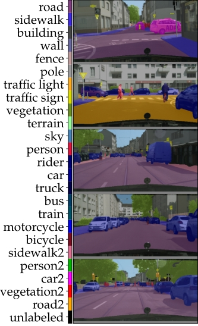
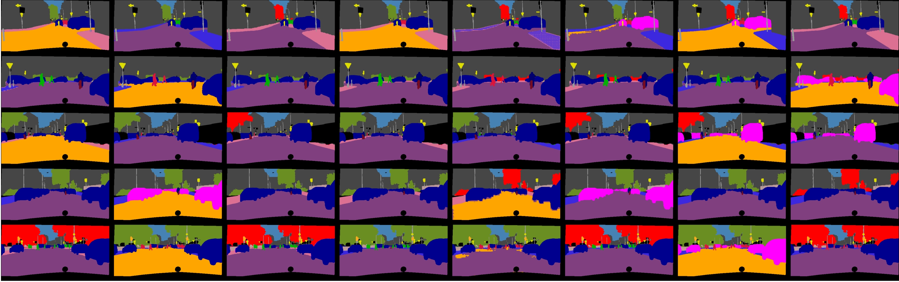
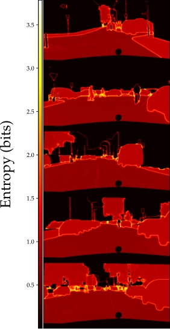

# Calibrated Adversarial Refinement for Multimodal Semantic Segmentation

PyTorch implementation of the Calibrated Adversarial Refinement models described in the paper <a href="https://arxiv.org/pdf/2006.13144.pdf"> Calibrated Adversarial Refinement for Multimodal Semantic Segmentation</a>. An overview of the model architecture is depicted below, with ambiguous boundary segmentation 
as a use case.

<p align="center">
 
</p>
 
Results on a multimodal Cityscapes dataset are shown below. The leftmost column illustrates input images overlaid with ground truth labels, the middle section shows 8 randomly sampled predictions from the refinement network, and the final column shows aleatoric uncertainty maps extracted from the calibration network.

  

## Getting Started

### Prerequisites
* Python3
* NVIDIA GPU + CUDA CuDNN


This was tested an Ubuntu 18.04 system, on a single 16GB Tesla V100 GPU, but might work on other operating systems as well.

### Setup virtual environment
To install the requirements for this code run:
```
python3 -m venv ~/carmss_venv
source ~/carmss_venv/bin/activate
pip install -r requirements.txt
```

### Directory tree
```
.
├── data
│   └── datasets
│       ├── lidc
│       └── cityscapes
│ 
├── models
│   ├── discriminators
│   ├── general
│   ├── generators
│   │   └── calibration_nets
│   └── losses
│        
├── results
│        └── output
│        
├── testing
│        
├── training
│        
└── utils
```

## Datasets

For the 1D regression dataset experiments, please refer to 
[this](https://github.com/gdikov/calibrated-adversarial-learning)
repository. Information on how to obtain the multimodal semantic segmentation datasets can be found below.

### Download the LIDC dataset

The pre-processed 180x180 2D crops for the Lung Image Database Consortium (LIDC) image collection dataset 
([LIDC-IDRI](https://wiki.cancerimagingarchive.net/display/Public/LIDC-IDRI))
, as described in 
[A Hierarchical Probabilistic U-Net for Modeling
Multi-Scale Ambiguities (2019)](https://arxiv.org/abs/1905.13077) and used in this work is made publicly available from Khol et. al, and can be downloaded from 
([here](https://console.cloud.google.com/storage/browser/hpunet-data/lidc_crops/)).

After downloading the dataset, extract each file under `./data/datasets/lidc/`. This should give three folders under the said directory named: `lidc_crops_test`, `lidc_crops_train`, and `lidc_crops_test`.

Please note that the official repository of the 
[Hierarchical Probabilistic U-Net](https://github.com/deepmind/deepmind-research/tree/master/hierarchical_probabilistic_unet)
, the version of the dataset linked above containts 8843 images for training, 1993 for validation and 1980 for testing rather than 8882, 1996 and 1992 images as used in our experiments, however, the score remains the same.

### Download the pre-processed Cityscapes dataset with the black-box predictions

As described in our paper, we integrate our model on top of a black-box segmentation network. We used a pre-trained *DeepLabV3+(Xception65+ASPP)* model publically available 
[here](https://github.com/nyoki-mtl/pytorch-segmentation)
. We found that this model obtains a mIoU score of 0.79 on the official test-set of the Cityscapes dataset
([Cityscapes](https://www.cityscapes-dataset.com/)).

To get the official 19-class Cityscapes dataset:

1) Visit the Cityscapes [website](https://www.cityscapes-dataset.com/) and create an account
2) Download the [images](https://www.cityscapes-dataset.com/file-handling/?packageID=3) and [annotations](https://www.cityscapes-dataset.com/file-handling/?packageID=1) 
3) Extract the files and move the folders *gtFine* and *leftImg8bit* in a new directory for the raw data i.e. `./data/datasets/cityscapes/raw_data`.
4) Create the 19-class labels by following [this issue](https://github.com/junfu1115/DANet/issues/12).
5) Configure your data directories in `./data/datasets/cityscapes/preprocessing_config.py` . 
6) Run `./data/datasets/cityscapes/preprocessing.py` to pre-process the data in downscaled numpy arrays and save under `./data/datasets/cityscapes/processed`.

Subsequently [download](https://drive.google.com/file/d/1EkJD1PUe7J5f5oc_VvUj-7a7XTT-I-Gc/view?usp=sharing) the black-box predictions under `./data/datasets/cityscapes/`, and extract by running `tar -zxvf cityscapes_bb_preds.tar.gz`

Finally, move the black-box predictions in the processed cityscapes folder and setup the test set run `./data/datasets/cityscapes/move_bb_preds.py`

## Train your own models

To train you own model on the LIDC dataset, set `LABELS_CHANNELS=2` in line 29 of `./utils/constants.py` run:

```
python main.py --mode train --debug '' --calibration_net SegNetCalNet --z_dim 8 --batch-size 32 --dataset LIDC --class_flip ''
```

To train you own model using the black-box predictions on the modified Cityscapes dataset, set `LABELS_CHANNELS=25` in line 29 of `./utils/constants.py` and run:

```
python main.py --mode train --debug '' --calibration_net ToyCalNet --z_dim 32 --batch-size 16 --dataset CITYSCAPES19 --class_flip True
```

Launching a run in train mode will create a new directory with the date and time of the start of your run under `./results/output/`, where plots documenting the progress of the training and are saved and models are checkpointed. For example, a run launched on 12:00:00 on 1/1/2020 will create a new folder
 `./results/output/2020-01-01_12:00:00/` . To prevent the creation of this directory, set `--debug False` in the run command above.


## Evaluation

### LIDC pre-trained model
A pre-trained model on LIDC can be downloaded from
[here](https://drive.google.com/file/d/1y9pasurOlANj2F01o4HrxyiUNHqN8JwX/view?usp=sharing).
To evaluate this model set `LABELS_CHANNELS=2`, move the downloaded pickle file under `./results/output/LIDC/saved_models/` and run:

```
python main.py --mode test --test_model_date LIDC --test_model_suffix LIDC_CAR_Model --calibration_net SegNetCalNet --z_dim 8 --dataset LIDC --class_flip ''
```

### Cityscapes pre-trained model
A pre-trained model on the modified Cityscapes dataset can be downloaded from
[here](https://drive.google.com/file/d/1MJzZbByAU7MjNUH1TCuOoA4fwNvK1XF9/view?usp=sharing).
To evaluate this model set `LABELS_CHANNELS=25` and `IMSIZE = (256, 512)` in `./utils/constants.py`, move the downloaded pickle file under `./results/output/CS/saved_models/` and run:

```
python main.py --mode test --test_model_date CS --test_model_suffix CS_CAR_Model --calibration_net ToyCalNet --z_dim 32 --dataset CITYSCAPES19 --class_flip True
```

## Citation
If you use this code for your research, please cite our paper <a href="https://arxiv.org/pdf/2006.13144.pdf"> Calibrated Adversarial Refinement for Multimodal Semantic Segmentation</a>:

```
@ARTICLE{2020arXiv200613144K,
       author = {{Kassapis}, Elias and {Dikov}, Georgi and {Gupta}, Deepak K. and
         {Nugteren}, Cedric},
        title = "{Calibrated Adversarial Refinement for Multimodal Semantic Segmentation}",
      journal = {arXiv e-prints},
     keywords = {Computer Science - Computer Vision and Pattern Recognition},
         year = 2020,
        month = jun,
          eid = {arXiv:2006.13144},
        pages = {arXiv:2006.13144},
archivePrefix = {arXiv},
       eprint = {2006.13144},
 primaryClass = {cs.CV},
       adsurl = {https://ui.adsabs.harvard.edu/abs/2020arXiv200613144K},
      adsnote = {Provided by the SAO/NASA Astrophysics Data System}
}
```

## License
The code in this repository is published under the [Apache License Version 2.0](LICENSE).
